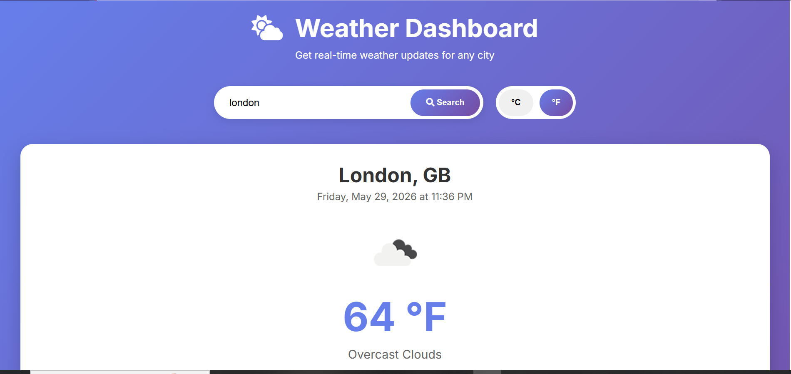

# Weather Dashboard 🌤️

A beautiful weather dashboard that shows real-time weather and 5-day forecast for any city.

## Features
- 🌡️ Current temperature, humidity, wind speed, pressure, visibility
- 📅 5-day weather forecast
- 🔄 Switch between °C and °F
- 🕒 Search history (saves recent searches)
- 📱 Responsive design (works on mobile/tablet/desktop)
- ⚡ Real-time data from OpenWeatherMap

## How to Use
1. Enter city name in search box (e.g., London, New York, Tokyo)
2. Press Search button or Enter key
3. View current weather conditions
4. Check 5-day forecast
5. Toggle between °C and °F using buttons
6. Click on recent searches for quick access

## Technologies Used
- HTML5
- CSS3 (Flexbox, Grid, Animations, Gradients)
- JavaScript (ES6+)
- OpenWeatherMap API
- Font Awesome Icons
- Google Fonts (Inter)

## Screenshots

## Author
**Aneela**

## Live Demo
[View Live Demo](https://yourusername.github.io/weather-dashboard)

---

*Note: Replace `yourusername` with your actual GitHub username after publishing.*